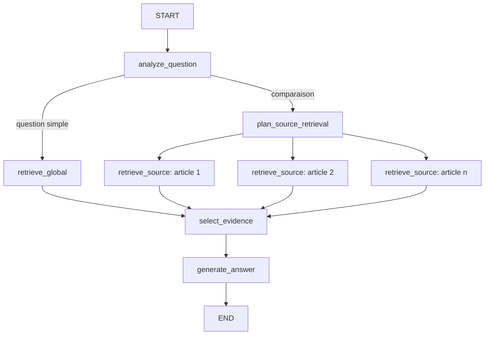

# Milestone 11 — Première amélioration RAG avec LangGraph

## Objectif

Corriger la faiblesse principale mesurée dans la baseline : aucune des cinq
questions comparatives ne passait. L'expérience doit préserver `/ask` comme
témoin et ajouter un second pipeline observable, évaluable sur le même
benchmark et utilisant le même embedding, le même Qwen et les mêmes règles de
citations.

## Ce que LangGraph apporte ici

LangGraph ne remplace ni Qdrant ni Qwen. Il décrit l'orchestration sous la forme
d'un graphe d'états : chaque nœud lit un état typé, effectue une responsabilité
précise, puis retourne seulement les champs qu'il modifie.



Les branches `retrieve_source` sont créées dynamiquement avec `Send`. Les listes
`retrieval_batches` et `trace` utilisent un reducer
`Annotated[list[...], operator.add]` : au lieu qu'une branche écrase les
résultats d'une autre, LangGraph concatène leurs sorties au prochain
superstep.

Cette v1 ne configure pas encore de checkpointer. L'état ne survit donc pas à
la requête HTTP. La persistance, les conversations multi-tours et les
interruptions humaines seront un milestone distinct afin de ne pas mélanger
orchestration et mémoire.

## Les deux routes

### Route simple

Une question qui ne demande pas plusieurs articles suit :

1. `analyze_question` ;
2. `retrieve_global` avec exactement le filtre documentaire demandé ;
3. `select_evidence` ;
4. `generate_answer`.

Cette route conserve le comportement de la baseline : une recherche E5, puis
un appel Qwen.

### Route comparative

Une comparaison suit :

1. détection des noms d'articles et des marqueurs de comparaison ;
2. création par Qwen d'une sous-requête propre à chaque article ;
3. validation stricte du JSON du planificateur ;
4. embedding en batch des sous-requêtes ;
5. recherche Qdrant parallèle, filtrée par `document_id` ;
6. récupération de 20 candidats par article ;
7. reranking transparent des candidats ;
8. sélection round-robin de cinq chunks au total ;
9. génération et validation de la réponse.

Le planificateur doit produire un objet JSON dont les clés sont exactement les
identifiants attendus et dont chaque valeur est une chaîne non vide. Si cette
validation échoue, `_build_source_query` fournit une reformulation
déterministe. Une consigne utilisateur injectée dans la question ne peut donc
pas changer le graphe ni ajouter un document arbitraire.

Le planificateur peut utiliser les connaissances du modèle pour formuler une
bonne recherche, mais la réponse finale ne peut utiliser que les chunks
récupérés. Cette séparation est essentielle : une requête peut contenir les
termes « contrastive image-text objective », mais chaque affirmation de la
réponse doit encore être justifiée par `[S1]`, `[S2]`, etc.

## Récupération et reranking

La première tentative envoyait la même question aux deux articles. Elle
couvrait bien les deux documents, mais ramenait des passages généraux et Qwen
s'abstenait. Une reformulation générique seule plaçait les preuves validées aux
rangs 13 et 8.

La version retenue récupère donc 20 candidats par source. Ce nombre est peu
coûteux dans une collection de 938 chunks. `_rerank_results` favorise ensuite :

1. les chunks de contenu plutôt que la section `References` ;
2. le recouvrement entre les mots-racines de la question et le titre de
   section ;
3. le recouvrement avec le texte complet ;
4. le score cosinus E5 pour départager.

Le reranker est déterministe et lisible. Il n'est pas encore un cross-encoder :
ce dernier sera une variante future à évaluer, pas une dépendance ajoutée sans
mesure.

Après reranking, le round-robin prend un passage de chaque article à chaque
tour. Avec deux sources et `top_k=5`, la fenêtre contient au plus trois passages
d'une source et deux de l'autre. Avec trois sources, chaque article est présent
avant qu'un article reçoive un deuxième passage.

## Garde-fous partagés avec la baseline

`app/rag_service.py` expose maintenant `answer_from_results`. Les deux pipelines
appellent exactement cette fonction après leur retrieval. Ils partagent donc :

- le system prompt fondé uniquement sur `EVIDENCES` ;
- les références serveur `[S1]`, `[S2]`, etc. ;
- la résolution des références vers les métadonnées Qdrant ;
- l'abstention si Qwen retourne `INSUFFICIENT_EVIDENCE` ;
- l'abstention si une référence manque ou pointe hors de la fenêtre fournie.

Ainsi, la comparaison entre `/ask` et `/agentic/ask` isole principalement la
stratégie de retrieval et le coût du planificateur.

## API et interface

`POST /agentic/ask` accepte le même `AskRequest` que `/ask`. Sa réponse hérite de
`AskResponse` et ajoute `execution` :

- stratégie `global` ou `per_source` ;
- articles détectés ;
- sous-requêtes planifiées ;
- nombre de candidats et de chunks sélectionnés ;
- nœuds exécutés, décisions et durées en millisecondes.

L'interface `/ui/` propose un sélecteur `LangGraph` / `Baseline`. En mode
LangGraph, une section repliable affiche la trace, tandis que les citations et
le texte intégral des chunks restent présentés comme auparavant.

## Scripts concernés

- `app/agentic_rag.py` : état typé, nœuds, transitions, fan-out, reranking et
  trace ;
- `app/rag_service.py` : génération et validation communes ;
- `app/llm_gateway.py` : longueur de génération paramétrable pour le court
  appel de planification ;
- `app/schemas.py` : contrat de réponse agentique ;
- `app/main.py` : route `/agentic/ask` ;
- `scripts/rag_evaluation_common.py` : métriques partagées ;
- `scripts/evaluate_agentic_rag.py` : campagne LangGraph ;
- `app/static/*` : sélecteur de pipeline et affichage de la trace.

La dépendance est épinglée à `langgraph==1.2.9` dans `requirements.txt` pour
rendre l'environnement reproductible.

## Évaluation reproductible

Un smoke test peut cibler un seul cas :

```powershell
docker compose run --rm api python -u -m scripts.evaluate_agentic_rag `
  --case-id compare-clip-dinov2-supervision-en `
  --limit 5 `
  --output /reports/agentic-rag-smoke.json
```

La campagne complète réutilise les 30 cas vérifiés :

```powershell
docker compose run --rm api python -u -m scripts.evaluate_agentic_rag `
  --limit 5 `
  --output /reports/agentic-rag-evaluation-verified.json
```

## Résultat du smoke test

| Mesure | Baseline | LangGraph v1 |
|---|---:|---:|
| Cas CLIP–DINOv2 réussi | non | oui |
| Couverture factuelle | 0,00 | 0,60 |
| Rappel des documents récupérés | 1,00 | 1,00 |
| Rappel des documents cités | 0,00 | 1,00 |
| Abstention | oui | non |
| Latence à froid | 42,85 s | 233,77 s |

La trace agentique décompose les 233,77 secondes :

- planification, embeddings compris : 36,97 s ;
- deux recherches Qdrant : 43 ms et 39 ms ;
- sélection : 9 ms ;
- génération : 196,73 s.

Ce résultat valide le mécanisme sur un cas, pas encore la qualité globale. Le
coût à froid est élevé : le même Qwen 7B réalise le plan puis la réponse. La
route simple n'appelle pas ce planificateur. Pour les comparaisons, une future
expérience devra opposer au moins trois variantes : règles déterministes,
petit modèle planificateur et Qwen 7B.

## Limites connues et prochaine décision

- un seul cas comparatif a été réévalué après correction ; il faut lancer les
  cinq comparaisons, puis les 30 cas pour détecter les régressions ;
- le reranking lexical reste plus fragile qu'un cross-encoder multilingue ;
- la détection des cinq articles utilise encore un catalogue d'alias codé ;
- le graphe n'a ni mémoire persistante, ni retries ciblés, ni human-in-the-loop ;
- la génération CPU reste de loin le goulot d'étranglement.

La prochaine étape rationnelle est d'évaluer d'abord les cinq comparaisons. Si
le gain se confirme, nous mesurerons un petit planificateur local et un
cross-encoder avant d'ajouter la persistance LangGraph. Cette discipline évite
de transformer le graphe en architecture complexe sans preuve d'amélioration.

## Mise à jour après la campagne comparative

Les cinq comparaisons ont depuis été exécutées. LangGraph v1 en fait passer
deux, contre aucune pour la baseline, mais ne retrouve que 4 des 11 chunks
cibles exacts. Le protocole, les résultats et le diagnostic sont consignés dans
`docs/milestones/12-evaluation-langgraph-comparaisons.md`.
