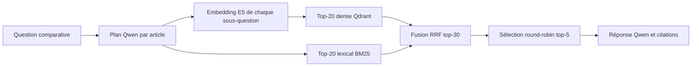

# Milestone 13 — Retrieval hybride, RRF et cross-encoder

## Objectif

Améliorer la sélection des chunks dans les questions comparatives et mesurer
chaque composant séparément avant de l'intégrer au graphe LangGraph.

Cette étape ne fait ni SFT ni RLHF. Elle agit uniquement sur le contexte remis
au LLM : un meilleur générateur ne peut pas citer une preuve que le retrieval
n'a pas sélectionnée.

## Architecture retenue



Chaque article possède sa propre branche. LangGraph peut exécuter ces branches
indépendamment. La sélection round-robin garantit ensuite que la source ayant
le meilleur score global ne monopolise pas les cinq places.

Les questions simples conservent la recherche dense globale précédente. Cette
itération modifie seulement la route `per_source`.

## 1. Recherche dense

`intfloat/multilingual-e5-small` transforme la sous-question en vecteur.
Qdrant retrouve les chunks dont les vecteurs ont la plus grande similarité.

Avantage : les formulations peuvent être différentes tout en partageant le
même sens. Limite : les nombres, noms de datasets et termes exacts ne dominent
pas toujours la similarité sémantique.

## 2. Recherche BM25

BM25 est un classement lexical fondé sur :

- la fréquence d'un terme dans un chunk ;
- sa rareté dans l'article ;
- une normalisation de la longueur du chunk.

Pour un terme `t` et un chunk `d`, l'implémentation utilise la forme classique :

```text
IDF(t) = log(1 + (N - df(t) + 0,5) / (df(t) + 0,5))

score(t,d) = IDF(t) × tf(t,d) × (k1 + 1)
             / (tf(t,d) + k1 × (1 - b + b × |d| / longueur_moyenne))
```

avec `k1=1,5` et `b=0,75`.

Les chunks sont lus depuis Qdrant puis indexés en mémoire par article. Une
normalisation légère enlève les accents, la casse, quelques mots vides et des
flexions anglaises fréquentes. Le cache est vidé après chaque réindexation du
corpus afin de ne jamais servir une ancienne version.

## 3. Fusion RRF

Les scores cosinus et BM25 n'ont pas la même échelle et ne doivent pas être
additionnés directement. Reciprocal Rank Fusion utilise seulement le rang :

```text
score_RRF(chunk) = somme_des_listes 1 / (60 + rang(chunk))
```

Un chunk présent dans les deux listes reçoit deux contributions et remonte.
Un chunk très bien classé par une seule méthode reste néanmoins candidat. RRF
est simple, déterministe et ne demande aucun entraînement.

## 4. Cross-encoder évalué

Un bi-encodeur comme E5 encode séparément la question et le chunk. Un
cross-encoder reçoit les deux textes ensemble ; l'attention peut comparer
directement chaque mot de la question à chaque mot du passage. Il est en
général plus précis, mais il faut une inférence par paire.

Le modèle évalué est
`cross-encoder/mmarco-mMiniLMv2-L12-H384-v1`, épinglé au commit
`e1f4a37b5ad572015a1340a48133713afb98e7fe`. Il couvre quinze langues et tourne
sur CPU via SentenceTransformers. Le téléchargement est local et reproductible
dans le volume Docker des modèles.

Sur ce benchmark, le cross-encoder améliore MRR et garantit une cible dans les
cinq questions, mais son rappel exact est inférieur à RRF et il ajoute environ
16,27 s. Il est donc implémenté et testable, mais non activé dans le graphe.

## Fichiers introduits ou modifiés

### `app/hybrid_retrieval.py`

Contient les briques indépendantes et testables :

- construction/cache de l'index BM25 ;
- recherche BM25 ;
- fusion RRF ;
- récupération dense + lexicale ;
- cross-encoder optionnel ;
- sélection équilibrée entre articles.

### `app/qdrant_gateway.py`

`list_document_chunks()` parcourt tous les points d'un article sans charger les
vecteurs. Le texte et les métadonnées suffisent pour construire BM25.

### `app/agentic_rag.py`

Le nœud `retrieve_source` demande désormais les deux listes, les fusionne et
enregistre dans la trace les nombres `dense`, `bm25` et `rrf`. Le nœud
`select_evidence` applique la sélection round-robin aux listes fusionnées.

### `app/settings.py` et `compose.yaml`

`RERANKER_MODEL_PATH` rend le chemin du cross-encoder explicite et monté dans
le volume persistant `model_cache`.

### `scripts/download_reranker_model.py`

Télécharge uniquement les fichiers nécessaires depuis une révision épinglée,
puis vérifie leur présence.

### `scripts/evaluate_hybrid_retrieval.py`

Rejoue les plans sauvegardés et compare les quatre stratégies sans appeler le
LLM de réponse. Le rapport contient les chunks sélectionnés, les mesures par
cas et les agrégats.

### `app/static/app.js`

L'interface affiche maintenant « score de classement ». En effet, le nombre
visible peut être une similarité dense, un score RRF ou un score de reranker ;
l'appeler toujours « similarité » serait faux.

## Commandes reproductibles

Télécharger une fois le cross-encoder :

```powershell
docker compose run --rm api python -m scripts.download_reranker_model
```

Évaluer RRF sans payer le coût du cross-encoder :

```powershell
docker compose run --rm api python -u -m scripts.evaluate_hybrid_retrieval `
  --skip-cross-encoder `
  --output /reports/hybrid-retrieval-comparisons-no-cross.json
```

Évaluer toutes les variantes :

```powershell
docker compose run --rm api python -u -m scripts.evaluate_hybrid_retrieval `
  --output /reports/hybrid-retrieval-comparisons.json
```

Le rapport humain complet est
`reports/hybrid-retrieval-comparisons-summary.md`.

## Résultats et décision

- LangGraph v1 : rappel exact macro @5 de 0,400 ;
- dense seul : 0,300 ;
- **hybride RRF : 0,567** ;
- hybride puis cross-encoder : 0,467.

Après intégration de RRF, la couverture factuelle end-to-end passe de 0,320 à
0,480. Le taux de passage reste à 2/5 : le retrieval s'améliore, mais la
génération n'exploite pas encore les preuves de façon assez stable.

## Limites connues

- cinq comparaisons constituent un échantillon trop petit pour choisir
  définitivement tous les hyperparamètres ;
- le tokenizer BM25 est volontairement simple et principalement orienté vers
  le texte scientifique anglais ;
- les plans Qwen sont régénérés dans le test end-to-end, donc la comparaison
  complète contient une variance absente du replay retrieval-only ;
- le cas français produit parfois la mauvaise langue ;
- avec trois articles et cinq chunks, la troisième source ne reçoit qu'une
  place au premier tour ;
- le cross-encoder Torch CPU n'a pas encore été exporté ni chronométré avec
  OpenVINO.

## Prochaine étape recommandée

Ajouter dans le nœud de génération un contrat de comparaison vérifiable : une
réponse dans la langue de la question, au moins une affirmation et une citation
par source attendue, puis une tentative corrective si le validateur détecte un
manque. Il faudra mesurer cette v3 sur le même benchmark avant d'envisager le
SFT.

## Références techniques

- Qdrant, hybrid queries et RRF :
  https://qdrant.tech/documentation/search/hybrid-queries/
- SentenceTransformers, API `CrossEncoder` :
  https://www.sbert.net/docs/package_reference/cross_encoder/model.html
- fiche du cross-encoder mMARCO :
  https://huggingface.co/cross-encoder/mmarco-mMiniLMv2-L12-H384-v1

La validation et la correction annoncées ici sont implémentées dans
`docs/milestones/14-contrat-reponse-langue-citations.md`.
